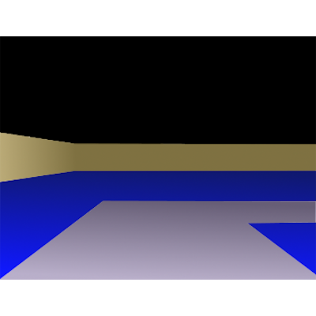

# よぉこそ　とみとみのページへ
いやまってたよぉ〜

## お前は誰ぞ？
山口大学の学生です。    
OSのタスクスイッチ機構からヘンテコなwebページまで、思いつくままにコードを書いてる人です。  
このサイトはenPiTのghpages演習の一環でmarkdownで作成したページです。  

## 作ったもの紹介
[RewritablePage]("https://github.com/Tomitomi1021/RewritablePage")   
†全てを書き換えられるwebページ†    
[swtch]("https://github.com/Tomitomi1021/swtch")  
ユーザーランドでOSごっこをしようプロジェクトの一部    
[xv6]("https://github.com/mit-pdos/xv6-public")
のタスクスイッチの部分のソースコードを読んでいてタスクスイッチにOSの権限が無いと実行できない命令を使用していないことに気が付き、OSのプロセス上でもタスクスイッチの機構が実現できるのではないかと考えて実装したもの。  
[UserlandScheduler]("https://github.com/Tomitomi1021/UserlandScheduler")  
ユーザーランドでOSごっこをしようプロジェクトの一部  
上のswtchを応用して、ユーザーランドでタスクスケジューラーを作ってみようとしたもの  
[waveart]("https://github.com/Tomitomi1021/waveart")  
波動関数の数値解析(for windows)  
[mosaic]("https://github.com/Tomitomi1021/mosaic")  
写真からモザイクアートを作るプログラム  
夢花博で展示したもの  
[tinylisp]("https://github.com/Tomitomi1021/tinylisp")  
lisp難しい。そうだ、lispインタプリタ作れば理解できるかもしれない。  
と考えて作ったもの
